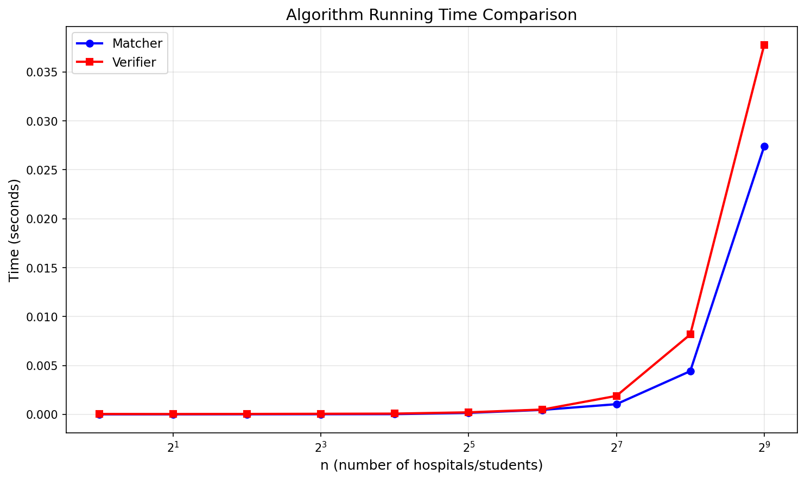

# Programming Assignment 1: Matching and Verifying

COP4533 - Algorithm Abstraction and Design

## Authors

- Pablo Pupo (96796601)
- Preston Hemmy (31020809)

## Setup

Requires Python 3.8+ with numpy and matplotlib:

```
python3 -m venv venv
source venv/bin/activate
pip install numpy matplotlib
```

## Running the Matcher

```
python3 src/matcher.py <input_file>
```

Example:
```
python3 src/matcher.py data/example.in
```

Output:
```
1 1
2 2
3 3
```

Each line is `i j` where hospital i is matched to student j.

## Running the Verifier

```
python3 src/verifier.py <input_file> <matching_file>
```

Example:
```
python3 src/verifier.py data/example.in data/example.out
```

Outputs `VALID STABLE` or an error like `INVALID (reason)` or `UNSTABLE (blocking pair: hospital X and student Y)`.

## Example Input/Output

See `data/example.in` and `data/example.out`.

Input format:
- First line: n
- Next n lines: hospital preference lists
- Next n lines: student preference lists

Output format: n lines of `i j` pairs (1-indexed).

## Task C: Scalability

Tested n = 1, 2, 4, 8, 16, 32, 64, 128, 256, 512.

| n | Matcher (s) | Verifier (s) |
|---|-------------|--------------|
| 1 | 0.000002 | 0.000036 |
| 2 | 0.000002 | 0.000030 |
| 4 | 0.000009 | 0.000040 |
| 8 | 0.000014 | 0.000056 |
| 16 | 0.000022 | 0.000075 |
| 32 | 0.000152 | 0.000207 |
| 64 | 0.000458 | 0.000492 |
| 128 | 0.001040 | 0.001887 |
| 256 | 0.004418 | 0.008166 |
| 512 | 0.027381 | 0.037761 |



Both algorithms run in O(n²) time. The matcher makes up to n² proposals, and the verifier checks up to n² pairs for blocking. The data confirms this—when n doubles, time roughly quadruples.
